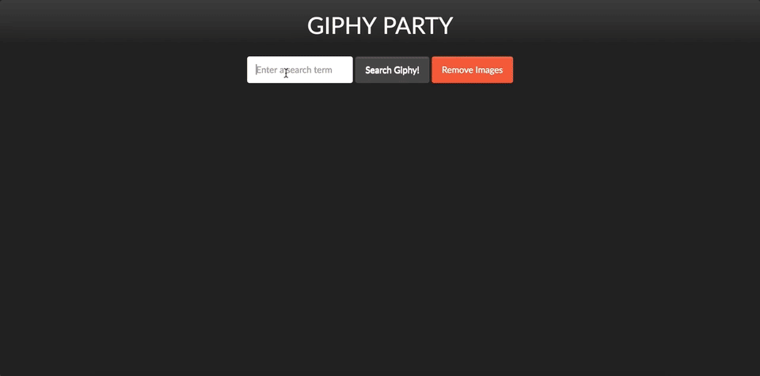

# AJAX Giphy Party

## The Application

Your application should do the following:

-   Allow the user to search for a GIF and when the form is submitted, make an AJAX request to the Giphy API and return a single GIF
-   Once the Giphy API has responded with data, append the GIF to the page
-   Allow the user to search for as many GIFs as they would like and keep appending them to the page
-   Allow the user to remove all of the GIFs by clicking a button
-   Here is an example of what the application might look like:

